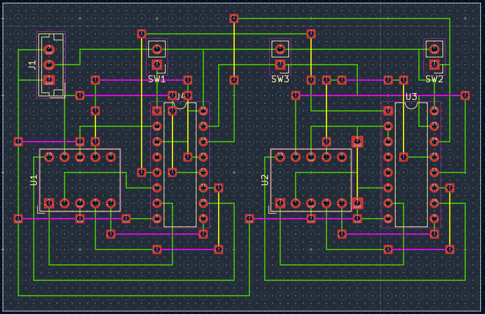

# BK_Perfboard_2.54

A KiCad 10 project template for planning, routing, and documenting
prototype circuits on standard 2.54 mm perfboard.

The template uses KiCad's PCB editor as a practical planning tool for
hand-wired perfboard projects. It provides a visual hole grid, dedicated
logical wiring and jumper layers, a custom solder/junction point
footprint, and a DRC-compatible workflow.

> **Status:** Version 1.0.0\
> **KiCad:** 10.x\
> **Grid:** 2.54 mm\
> **Default board area:** 121.92 × 81.28 mm (approximately 120 × 80 mm)

## Overview

BK_Perfboard_2.54 is intended for hobby electronics projects assembled
on single-sided 2.54 mm perfboard.

The goal is not to simulate physical perfboard perfectly. Instead, the
template provides a clear and practical model for component placement,
bottom- and component-side wiring, wire jumpers, intentional
solder/junction points, ERC/DRC-assisted checks, and documentation
before physical assembly.



## Why use KiCad for perfboard?

Perfboard projects often become difficult to review once the circuit
contains more than a few components. A schematic alone does not describe
how the circuit will actually be wired, while a hand-drawn wiring plan
quickly becomes hard to maintain.

This template keeps the schematic and planned physical wiring in the
same KiCad project.

**Schematic → ERC → Footprint placement → Perfboard routing → DRC →
Physical assembly**

`<tbd img circuit>`{=html}

```{=html}
<!-- Replace with:

-->
```
## Main Features

### 2.54 mm visual perfboard grid

A subtle hole grid on `User.Drawings` represents the physical perfboard
and helps align components with the real 2.54 mm pitch. The grid objects
are grouped and intentionally unobtrusive.

`<tbd img grid>`{=html}

```{=html}
<!-- Replace with:

-->
```
### Dedicated wiring layers

  KiCad layer   Template name   Purpose
  ------------- --------------- -------------------------------------
  `B.Cu`        Bottom Wire     Preferred wiring on the solder side
  `F.Cu`        Top Wire        Wiring on the component side
  `In1.Cu`      Top Jumper      Wire jumpers on the component side
  `In2.Cu`      Bottom Jumper   Wire jumpers on the solder side

`Bottom Wire (B.Cu)` is the preferred/default working layer.

These layers are a logical planning model. They do **not** imply that
the physical perfboard is a four-layer PCB.

`<tbd img layers>`{=html}

```{=html}
<!-- Replace with:

-->
```
### BK_Perf_SolderPoint

The included `BK_Perf_SolderPoint` footprint represents an intentional
electrical solder, junction, or transition point.

Typical uses include:

-   transitions between wire and jumper layers,
-   defined termination points for wire jumpers,
-   net branches,
-   T-junctions for multiple connections of the same net.

Its rounded rectangular shape deliberately distinguishes it from
ordinary component pads.

`<tbd img solderpoint>`{=html}

```{=html}
<!-- Replace with:

-->
```
### Grid-aligned board outline

The default outline is approximately 120 × 80 mm and aligned to the 2.54
mm grid:

**121.92 × 81.28 mm**

`Edge.Cuts` intentionally passes through grid points. This makes
resizing in full 2.54 mm increments simple. The outline is only a
starting point and can be adapted to the actual perfboard.

## Recommended Workflow

1.  Create the schematic.
2.  Run ERC and resolve errors and warnings.
3.  Mark intentionally unused pins with KiCad `No Connect` markers.
4.  Assign suitable footprints.
5.  Update the PCB from the schematic.
6.  Place components on the 2.54 mm grid.
7.  Route normal wiring primarily on `Bottom Wire (B.Cu)`.
8.  Add jumpers and `BK_Perf_SolderPoint` junctions where required.
9.  Review the layout for real-world solderability and mechanical
    access.
10. Run DRC and resolve unintended violations.
11. Compare the finished layout with the actual components and perfboard
    before assembly.

A clean ERC/DRC confirms the consistency of the KiCad model, but it
cannot guarantee that every connection is mechanically accessible or
convenient to solder.

## Routing Philosophy

> **As much structure as necessary, as little complexity as possible.**

Practical recommendations:

-   Prefer `B.Cu` for normal wiring.
-   Keep connections easy to trace.
-   Use jumpers deliberately rather than trying to eliminate every
    crossing.
-   Use SolderPoints for meaningful physical junctions and transitions.
-   Combine multiple connections of the same net at one SolderPoint
    where practical.
-   Do not optimize purely for shortest track length if a slightly
    longer route is easier to understand and solder.
-   Remember that component-side connections may be difficult around DIL
    sockets, modules, large capacitors, or densely packed components.

## Example Project

The template was validated with a non-trivial example consisting of two
CD4033 decade counter / 7-segment display drivers, two 7-segment
displays, Count/Reset/Lamp Test push buttons, 5 V power input, multiple
wiring layers, and `BK_Perf_SolderPoint` junctions.

The completed example passed ERC and DRC without errors or warnings.

`<tbd img example>`{=html}

```{=html}
<!-- Replace with:

-->
```
The example project should be kept separately from the template so newly
created projects start clean.

## Template Structure

``` text
BK_Perfboard_2.54/
├── assets/
├── docs/
├── footprints/
├── meta/
│   └── info.html
├── symbols/
├── CHANGELOG.md
├── README.md
├── BK_Perfboard_2.54.kicad_pcb
├── BK_Perfboard_2.54.kicad_pro
└── BK_Perfboard_2.54.kicad_sch
```

Additional project-specific directories may be present depending on the
local workflow.

## Documentation

Detailed usage documentation is maintained in German and English:

-   `docs/Perfboard-Layout_de.md`
-   `docs/Perfboard-Layout_en.md`

The changelog is maintained in English only:

-   `CHANGELOG.md`

## Installation

Copy the complete `BK_Perfboard_2.54` directory into your KiCad user
template directory.

For KiCad 10 on macOS, a typical location is:

``` text
~/Documents/KiCad/10.0/template/BK_Perfboard_2.54
```

Then use KiCad's **New Project from Template** function and select
`BK_Perfboard_2.54`.

Template locations may differ on other operating systems or custom
installations.

## Limitations

This template intentionally uses KiCad PCB concepts to model a physical
hand-wired perfboard. Some KiCad behavior therefore reflects real PCB
geometry rather than insulated hand wiring.

For example, through-hole objects may affect routing on another logical
layer at the same physical position.

The template assists planning and validation but does not replace
practical judgement during assembly.

## Requirements

-   KiCad 10.x
-   Basic KiCad schematic and PCB editor knowledge
-   Standard 2.54 mm perfboard

## Contributing

Suggestions and improvements are welcome. Please keep the project's main
goals in mind:

-   simple workflow,
-   clear visual representation,
-   practical hobby use,
-   minimal special rules,
-   standard KiCad functionality without required plugins.

## License

MIT License, Copyright (c) 2026 Bernd Klein

## Version

Current release: **1.0.0**
